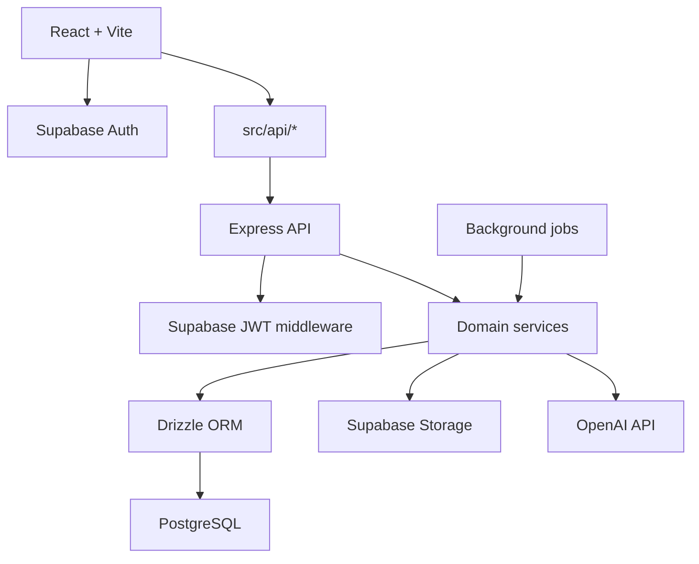

# Base44 Migration Report

Date: 2026-05-05
Branch: remove-base44
Workspace: EliteTC_PRO

## Executive Summary

The application is still materially coupled to Base44 in three places:

1. Frontend session control and routing.
2. Frontend direct entity access from many screens.
3. A large Base44 serverless function layer that performs privileged writes, AI calls, file storage, email, and workflow automation.

Current scan results:

- 131 frontend files in src still reference Base44.
- 97 Base44 function files under base44/functions still depend on the Base44 runtime or SDK.
- The Vite build still depends on @base44/vite-plugin.
- There is a duplicated nested project tree under EliteTC_PR mirroring much of the same Base44 surface. Treat it as a secondary migration target or archive candidate so it does not drift.

Production priorities for this migration:

1. User isolation and authorization correctness.
2. Authentication stability during cutover.
3. Transaction data integrity.
4. Minimal disruption to existing routes and UI structure.

## Critical Blocking Dependencies

### Blocker 1: Base44 controls the frontend session lifecycle

Primary files:

- src/api/base44Client.js
- src/lib/AuthContext.jsx
- src/lib/app-params.js
- src/lib/CurrentUserContext.jsx
- src/components/auth/RequireAuth.jsx
- src/components/auth/AuthGate.jsx
- src/App.jsx

Why this blocks migration:

- base44.auth.me() is the source of truth for both authentication and current user profile.
- base44.auth.redirectToLogin() is hard-coded into route protection.
- Session persistence depends on Base44-specific localStorage and cookie keys.

Representative snippet:

```jsx
const currentUser = await base44.auth.me();
const token = localStorage.getItem('base44_access_token');
base44.auth.redirectToLogin(window.location.href);
```

Recommended replacement:

- Supabase Auth for session and refresh token management.
- A single AppUser provider that loads the authenticated user profile from your Express API.
- Route guards that depend on Supabase session state plus backend profile/bootstrap status.

### Blocker 2: Multi-tenant access is enforced by Base44 functions and service-role patterns

Primary files:

- src/lib/useDealAccess.js
- base44/functions/getTeamTransactions/entry.ts
- base44/functions/claimDeal/entry.ts
- base44/functions/createTransaction/entry.ts
- base44/functions/updateTransaction/entry.ts
- base44/functions/deleteTransaction/entry.ts
- base44/functions/manageTeam/entry.ts

Why this blocks migration:

- Many UI screens trust function responses to enforce which deals a user can see.
- Several functions use asServiceRole to bypass Base44 row-level restrictions and then re-implement access checks manually.
- A careless rewrite here is the highest-risk area for multi-user data leakage.

Representative snippet:

```ts
const txList = await base44.asServiceRole.entities.Transaction.filter({ id: transaction_id });
const memberships = await base44.asServiceRole.entities.TeamMember.filter({ user_id: user.id });
if (!memberTeamIds.includes(tx.team_id)) {
  return Response.json({ error: 'You are not a member of this deal\'s team' }, { status: 403 });
}
```

Recommended replacement:

- Express middleware resolving the authenticated Supabase user.
- PostgreSQL authorization predicates scoped by team membership, brokerage, assigned_tc_id, created_by_user_id, and explicit collaborator tables.
- Drizzle queries that never execute broad reads before filtering by tenant scope.

### Blocker 3: The frontend still performs direct Base44 entity CRUD

Representative files:

- src/pages/Documents.jsx
- src/pages/Deadlines.jsx
- src/pages/Settings.jsx
- src/pages/UserManagement.jsx
- src/pages/Transactions.jsx
- src/pages/TransactionDetail.jsx
- src/components/transactions/*
- src/components/templates/*

Why this blocks migration:

- The current UI assumes a client-side ORM-like SDK with list/filter/create/update/delete methods.
- Migrating to Express requires replacing these with typed HTTP clients or React Query wrappers.

Representative snippet:

```jsx
queryFn: () => base44.entities.Document.list("-created_date"),
mutationFn: (id) => base44.entities.Document.delete(id),
const doc = await base44.entities.Document.create({ ... })
```

Recommended replacement:

- A src/api directory with modules like transactions.ts, documents.ts, users.ts, billing.ts.
- React Query hooks wrapping fetch or axios calls to Express routes.

### Blocker 4: AI and document parsing run inside Base44 integrations

Primary files:

- src/components/ai/GlobalAIAssistant.jsx
- src/components/ai/TCAIAssistant.jsx
- base44/functions/complianceEngine/entry.ts
- base44/functions/autoPlaceSignatures/entry.ts
- base44/functions/transactionIntelligenceAgent/entry.ts
- base44/functions/superagentMonitor/entry.ts
- base44/functions/superagentDeadlineMonitor/entry.ts
- base44/functions/superagentWeeklySummary/entry.ts

Why this blocks migration:

- The current app uses Base44 Core.InvokeLLM and ExtractDataFromUploadedFile rather than direct OpenAI or your own orchestration layer.
- AI output also writes directly into Base44 entities like ComplianceIssue, ComplianceReport, AIActivityLog, and MonitorAlert.

Representative snippet:

```ts
const result = await base44.integrations.Core.InvokeLLM({ prompt, response_json_schema: { ... } });
const extraction = await base44.asServiceRole.integrations.Core.ExtractDataFromUploadedFile({ file_url, json_schema: { ... } });
```

Recommended replacement:

- Express AI routes calling OpenAI Responses API directly.
- A file-extraction pipeline using PDFs/text extraction libraries before LLM calls.
- Explicit persistence of AI runs into PostgreSQL tables.

## Categorized Findings

### Authentication

Files:

- src/api/base44Client.js
- src/lib/AuthContext.jsx
- src/lib/app-params.js
- src/lib/CurrentUserContext.jsx
- src/components/auth/RequireAuth.jsx
- src/components/auth/AuthGate.jsx
- src/components/ProtectedRoute.jsx
- src/pages/TCSignIn.jsx
- src/pages/Landing.jsx
- src/pages/BrokerageSetup.jsx
- src/pages/Settings.jsx
- src/pages/onboarding/Step1Profile.jsx
- src/pages/onboarding/Step2Intent.jsx
- src/pages/onboarding/Step3Transaction.jsx
- src/pages/onboarding/Step4Document.jsx
- src/pages/onboarding/Step5Value.jsx
- base44/functions/checkUserExists/entry.ts
- base44/functions/changePlan/entry.ts
- base44/functions/deleteUserAccount/entry.ts

Dependency type:

- Base44 auth session, login redirect, logout, profile mutation.

Representative snippets:

```jsx
const currentUser = await base44.auth.me();
await base44.auth.logout();
base44.auth.redirectToLogin("/Dashboard");
await base44.auth.updateMe({ onboarding_step: 5 });
```

Recommended replacement:

- Replace with @supabase/supabase-js.
- Move profile mutations out of auth metadata into an app_user_profiles table.
- Keep onboarding flags in PostgreSQL, not the auth provider user blob.

### Database / Entities

Representative files:

- src/pages/AddTransaction.jsx
- src/pages/Documents.jsx
- src/pages/Deadlines.jsx
- src/pages/Dashboard.jsx
- src/pages/Settings.jsx
- src/pages/Transactions.jsx
- src/pages/UserManagement.jsx
- src/components/agents/AgentCodePanel.jsx
- src/components/transactions/TransactionDocumentsTab.jsx
- src/components/utils/tenantUtils.jsx
- base44/functions/createTransaction/entry.ts
- base44/functions/updateTransaction/entry.ts
- base44/functions/createTransactionFromContract/entry.ts
- base44/functions/claimDeal/entry.ts
- base44/functions/deleteTransaction/entry.ts
- base44/functions/deleteDocument/entry.ts
- base44/functions/getTeamTransactions/entry.ts
- base44/functions/manageTeam/entry.ts
- base44/functions/listUsers/entry.ts
- base44/functions/updateUserRole/entry.ts

Dependency type:

- CRUD through base44.entities.* and service-role entity access.

Representative snippets:

```jsx
const tx = await base44.entities.Transaction.create(data);
await base44.entities.DocumentChecklistItem.bulkCreate(checklistData);
queryFn: () => base44.entities.InAppNotification.filter({ user_email: currentUser.email })
```

```ts
await base44.asServiceRole.entities.Transaction.update(transaction_id, {
  assigned_tc_id: user.id,
  status: 'active'
});
```

Recommended replacement:

- PostgreSQL tables managed through Drizzle.
- Service layer in Express for each aggregate: transactions, documents, notifications, users, billing, teams.
- Replace list/filter semantics with explicit REST or RPC endpoints.

### API Calls / Functions

Representative frontend callers:

- src/hooks/useDeadlineAlerts.js
- src/pages/AgentIntake.jsx
- src/pages/ApprovalAction.jsx
- src/pages/Billing.jsx
- src/pages/ClientLookup.jsx
- src/pages/DeadlineResponse.jsx
- src/pages/Invoices.jsx
- src/pages/Notifications.jsx
- src/pages/SignDocument.jsx
- src/pages/Transactions.jsx
- src/pages/UserManagement.jsx

Representative backend functions:

- base44/functions/createTransaction/entry.ts
- base44/functions/submitIntake/entry.ts
- base44/functions/handleApprovalAction/entry.ts
- base44/functions/deadlineResponse/entry.ts
- base44/functions/deadlineEngine/entry.ts
- base44/functions/signatureService/entry.ts
- base44/functions/portalLookup/entry.ts
- base44/functions/portalAddNote/entry.ts
- base44/functions/changePlan/entry.ts
- base44/functions/sendInvoiceEmail/entry.ts

Dependency type:

- base44.functions.invoke(...) as the frontend API layer.

Representative snippet:

```jsx
await base44.functions.invoke("createTransaction", payload);
await base44.functions.invoke("portalLookup", { code: code.trim() });
await base44.functions.invoke("signatureService", { action: "send", request_id, token });
```

Recommended replacement:

- Express routes under /api.
- Frontend client modules like api/transactions.ts, api/portal.ts, api/signatures.ts, api/billing.ts.
- Introduce shared request/response schemas with zod.

### AI Integrations

Files:

- src/components/ai/GlobalAIAssistant.jsx
- src/components/ai/TCAIAssistant.jsx
- base44/functions/complianceEngine/entry.ts
- base44/functions/autoPlaceSignatures/entry.ts
- base44/functions/transactionIntelligenceAgent/entry.ts
- base44/functions/detectPhaseCompletion/entry.ts
- base44/functions/superagentAddendumGenerator/entry.ts
- base44/functions/superagentDeadlineMonitor/entry.ts
- base44/functions/superagentMonitor/entry.ts
- base44/functions/superagentWeeklySummary/entry.ts
- base44/functions/triageFeedback/entry.ts

Dependency type:

- Base44 LLM invocation and AI-triggered persistence.

Representative snippets:

```jsx
const response = await base44.integrations.Core.InvokeLLM({ prompt });
```

```ts
const result = await base44.asServiceRole.integrations.Core.InvokeLLM({
  prompt,
  response_json_schema: { ... }
});
```

Recommended replacement:

- OpenAI SDK on the backend.
- Prompt orchestration and schema validation in Express.
- Save AI activity, monitor alerts, and compliance findings into PostgreSQL.

### File Uploads / Storage

Files:

- src/pages/AgentIntake.jsx
- src/pages/AgentSubmitTransaction.jsx
- src/pages/Documents.jsx
- src/pages/SetupProfile.jsx
- src/pages/onboarding/Step4Document.jsx
- base44/functions/dotloopWebhook/entry.ts
- base44/functions/dropboxSignWebhook/entry.ts
- base44/functions/exportUserData/entry.ts
- base44/functions/generateAddendum/entry.ts

Dependency type:

- Base44 file upload, private file export, and signed URL generation.

Representative snippets:

```jsx
const { file_url } = await base44.integrations.Core.UploadFile({ file });
```

```ts
const { file_uri } = await base44.asServiceRole.integrations.Core.UploadPrivateFile({ file });
const { signed_url } = await base44.asServiceRole.integrations.Core.CreateFileSignedUrl({ file_uri });
```

Recommended replacement:

- Supabase Storage for public/private buckets.
- Signed upload and download URLs issued from Express.
- Store only storage keys and metadata in PostgreSQL, not raw provider URLs.

### Middleware / Platform Glue

Files:

- vite.config.js
- src/api/base44Client.js
- src/lib/app-params.js
- base44/functions/*/entry.ts

Dependency type:

- Base44 Vite plugin, runtime request client, and Deno entrypoints.

Representative snippets:

```js
import base44 from "@base44/vite-plugin"
legacySDKImports: process.env.BASE44_LEGACY_SDK_IMPORTS === 'true'
```

```ts
import { createClientFromRequest } from 'npm:@base44/sdk@0.8.25';
Deno.serve(async (req) => { ... })
```

Recommended replacement:

- Plain Vite config with React plugin only.
- Express handlers and middleware using Node runtime.

### Environment Variables

Files:

- src/lib/app-params.js
- vite.config.js
- package.json

Dependency type:

- Base44 app ID, function version, app base URL, legacy SDK switch.

Detected variables and keys:

- VITE_BASE44_APP_ID
- VITE_BASE44_FUNCTIONS_VERSION
- VITE_BASE44_APP_BASE_URL
- BASE44_LEGACY_SDK_IMPORTS
- localStorage key: base44_access_token
- cookie key: b44_access_token

Recommended replacement:

- Remove Base44 envs once the new API client is in place.
- Replace with Supabase and backend envs listed below.

### Utilities / Hooks

Files:

- src/components/auth/useCurrentUser.jsx
- src/lib/CurrentUserContext.jsx
- src/lib/useDealAccess.js
- src/components/utils/tenantUtils.jsx
- src/hooks/useDeadlineAlerts.js

Dependency type:

- User shim, access filtering, audit log helper, notification helper, function-backed hooks.

Representative snippets:

```jsx
return { data: currentUser, isLoading };
```

```jsx
await base44.entities.AuditLog.create({ ... });
await base44.entities.InAppNotification.create({ ... });
```

Recommended replacement:

- Centralize all app-side helpers around REST clients.
- Never write audit logs or notifications directly from the browser after migration.

### Routing / Protected Routes

Files:

- src/App.jsx
- src/components/auth/RequireAuth.jsx
- src/components/auth/AuthGate.jsx
- src/components/ProtectedRoute.jsx
- src/lib/PageNotFound.jsx
- src/pages/Landing.jsx

Dependency type:

- Base44 login redirect and route gating bound to Base44 user presence.

Representative snippets:

```jsx
if (!isLoadingAuth && !user) {
  base44.auth.redirectToLogin(window.location.href);
}
```

Recommended replacement:

- Route guard checks against Supabase session plus backend profile load state.
- Preserve public routes, but remove provider-specific redirects from components.

## Files To Modify First

Modify these first, in this order:

1. src/api/base44Client.js
2. src/lib/app-params.js
3. src/lib/AuthContext.jsx
4. src/lib/CurrentUserContext.jsx
5. src/components/auth/useCurrentUser.jsx
6. src/components/auth/RequireAuth.jsx
7. src/components/auth/AuthGate.jsx
8. src/App.jsx
9. src/lib/useDealAccess.js
10. src/pages/Landing.jsx
11. src/pages/TCSignIn.jsx
12. src/pages/AgentIntake.jsx
13. src/pages/Settings.jsx

Reason:

- These files define session acquisition, redirect behavior, current-user shape, onboarding gating, and the first multi-user access path used across the application.

## Safe Migration Sequence

### Phase 1: Replace Authentication Layer

Objectives:

- Replace Base44 auth with Supabase Auth.
- Replace current user context.
- Replace protected route logic.

Do first:

1. Add a Supabase client and session provider.
2. Introduce an Express /api/me endpoint returning the application user profile.
3. Replace Base44 auth token storage with Supabase session persistence.
4. Keep existing page structure and routing, only swap the provider and guards.

Suggested replacement code:

```ts
// src/lib/supabase.ts
import { createClient } from '@supabase/supabase-js';

export const supabase = createClient(
  import.meta.env.VITE_SUPABASE_URL,
  import.meta.env.VITE_SUPABASE_ANON_KEY
);
```

```tsx
// src/lib/AuthContext.tsx
import { createContext, useContext, useEffect, useState } from 'react';
import { supabase } from '@/lib/supabase';

const AuthContext = createContext(null);

export function AuthProvider({ children }) {
  const [session, setSession] = useState(null);
  const [authUser, setAuthUser] = useState(null);
  const [isLoadingAuth, setIsLoadingAuth] = useState(true);

  useEffect(() => {
    supabase.auth.getSession().then(({ data }) => {
      setSession(data.session ?? null);
      setAuthUser(data.session?.user ?? null);
      setIsLoadingAuth(false);
    });

    const { data: sub } = supabase.auth.onAuthStateChange((_event, nextSession) => {
      setSession(nextSession ?? null);
      setAuthUser(nextSession?.user ?? null);
      setIsLoadingAuth(false);
    });

    return () => sub.subscription.unsubscribe();
  }, []);

  return <AuthContext.Provider value={{ session, authUser, isLoadingAuth }}>{children}</AuthContext.Provider>;
}

export function useAuth() {
  return useContext(AuthContext);
}
```

```tsx
// src/components/auth/RequireAuth.tsx
import { Navigate, useLocation } from 'react-router-dom';
import { useAuth } from '@/lib/AuthContext';

export default function RequireAuth({ children }) {
  const { authUser, isLoadingAuth } = useAuth();
  const location = useLocation();

  if (isLoadingAuth) return null;
  if (!authUser) return <Navigate to="/" replace state={{ next: location.pathname }} />;
  return children;
}
```

### Phase 2: Replace Base44 Entity / Database Access

Objectives:

- Replace frontend entity calls with Express endpoints.
- Replace Base44 entities with PostgreSQL + Drizzle ORM.

Do first:

1. Model the core tables: users, brokerages, teams, team_members, transactions, documents, notifications, audit_logs.
2. Replace useDealAccess and transactions/documents screens with API-backed hooks.
3. Preserve current access rules in SQL or service-layer predicates before expanding features.

Suggested replacement code:

```ts
// backend/db/schema/transactions.ts
export const transactions = pgTable('transactions', {
  id: uuid('id').defaultRandom().primaryKey(),
  brokerageId: uuid('brokerage_id').notNull(),
  createdByUserId: uuid('created_by_user_id').notNull(),
  assignedTcUserId: uuid('assigned_tc_user_id'),
  address: text('address').notNull(),
  status: text('status').notNull(),
  teamId: uuid('team_id'),
  createdAt: timestamp('created_at', { withTimezone: true }).defaultNow().notNull(),
});
```

```ts
// backend/routes/transactions.ts
router.get('/', requireAuth, async (req, res) => {
  const rows = await transactionService.listVisibleTransactions(req.user.id);
  res.json({ transactions: rows });
});
```

### Phase 3: Replace Base44 Functions With Express API Routes

Objectives:

- Re-home all base44.functions.invoke consumers.

Priority route groups:

1. transactions
2. documents
3. users and team management
4. portal and intake flows
5. signatures
6. billing
7. notifications and deadlines

Mapping examples:

- createTransaction -> POST /api/transactions
- updateTransaction -> PATCH /api/transactions/:id
- deleteTransaction -> DELETE /api/transactions/:id
- getTeamTransactions -> GET /api/transactions
- portalLookup -> POST /api/portal/lookup
- handleApprovalAction -> POST /api/approvals/action
- signatureService -> POST /api/signatures/actions

### Phase 4: Replace Base44 AI Integrations With OpenAI API

Objectives:

- Replace InvokeLLM and ExtractDataFromUploadedFile.

Do first:

1. Move prompt logic to backend services.
2. Add deterministic extraction before LLM calls where possible.
3. Keep AI writes behind explicit service functions that enforce tenant scope.

Suggested replacement code:

```ts
import OpenAI from 'openai';

const openai = new OpenAI({ apiKey: process.env.OPENAI_API_KEY });

const response = await openai.responses.create({
  model: 'gpt-4.1-mini',
  input: prompt,
  text: {
    format: {
      type: 'json_schema',
      name: 'compliance_report',
      schema: schemaObject,
    },
  },
});
```

### Phase 5: Remove Remaining Base44 SDK Dependencies

Remove only after Phases 1 through 4 are stable:

- @base44/vite-plugin
- src/api/base44Client.js
- Base44 environment variables
- Base44 cookie and localStorage handling
- base44/ directory once every referenced function has an Express replacement

## Migration Checklist

- Add Supabase client and auth provider.
- Implement backend auth middleware using Supabase JWT verification.
- Add app_user_profiles table and /api/me endpoint.
- Replace AuthContext and CurrentUserContext.
- Replace RequireAuth and AuthGate.
- Replace useDealAccess with backend-backed transaction visibility queries.
- Create Drizzle schema for core transaction entities.
- Implement transaction CRUD routes.
- Implement document CRUD and storage upload routes.
- Implement audit log and notification writes on the backend.
- Replace high-traffic screens: Transactions, TransactionDetail, Documents, Dashboard, Settings.
- Recreate portal and intake routes.
- Recreate signature routes and webhook handlers.
- Recreate deadline and compliance engines as backend jobs or queue workers.
- Recreate AI assistant endpoints using OpenAI.
- Remove Base44 Vite plugin and Base44 env vars.
- Delete Base44-specific storage/session keys.
- Archive or remove the duplicate EliteTC_PR tree after deciding its role.

## Recommended Folder Structure

```text
src/
  api/
    client.ts
    auth.ts
    transactions.ts
    documents.ts
    users.ts
    portal.ts
    billing.ts
    ai.ts
  lib/
    supabase.ts
    auth/
      AuthProvider.tsx
      AppUserProvider.tsx
      RequireAuth.tsx
  hooks/
    useCurrentUser.ts
    useTransactions.ts
    useDocuments.ts
backend/
  src/
    server.ts
    config/
    middleware/
      requireAuth.ts
      requireRole.ts
      requireBrokerageScope.ts
    db/
      client.ts
      schema/
      migrations/
    routes/
      auth.ts
      transactions.ts
      documents.ts
      users.ts
      teams.ts
      portal.ts
      signatures.ts
      billing.ts
      ai.ts
    services/
      transactionService.ts
      documentService.ts
      notificationService.ts
      auditService.ts
      aiService.ts
      signatureService.ts
    jobs/
      deadlineEngine.ts
      complianceEngine.ts
      weeklyAgentUpdates.ts
```

## Required NPM Packages

Frontend:

- @supabase/supabase-js
- zod
- react-router-dom
- @tanstack/react-query

Backend:

- express
- cors
- dotenv
- drizzle-orm
- pg
- drizzle-kit
- @supabase/supabase-js
- jose or @supabase/ssr-compatible JWT verification approach
- zod
- multer or busboy
- openai
- pdf-parse or pdfjs-dist
- mammoth for docx extraction if needed
- nodemailer or your transactional provider SDK

Optional but likely useful:

- pino
- pino-http
- bullmq or pg-boss
- stripe

## Required Environment Variables

Frontend:

- VITE_SUPABASE_URL
- VITE_SUPABASE_ANON_KEY
- VITE_API_BASE_URL

Backend:

- PORT
- DATABASE_URL
- SUPABASE_URL
- SUPABASE_ANON_KEY
- SUPABASE_SERVICE_ROLE_KEY
- SUPABASE_JWT_SECRET or verification configuration
- OPENAI_API_KEY
- STRIPE_SECRET_KEY
- STRIPE_WEBHOOK_SECRET
- SUPABASE_STORAGE_BUCKET_PUBLIC
- SUPABASE_STORAGE_BUCKET_PRIVATE
- EMAIL_PROVIDER_API_KEY or SMTP_* variables
- DROPBOX_SIGN_API_KEY if signature flow remains
- DOTLOOP_CLIENT_ID and DOTLOOP_CLIENT_SECRET if retained
- SKYSLOPE_CLIENT_ID and SKYSLOPE_CLIENT_SECRET if retained

## Suggested Architecture Changes

1. Treat auth identity and application profile as separate concerns.
2. Move every privileged write behind backend routes or jobs.
3. Replace browser-side audit logging and notification creation with backend services.
4. Store only storage keys in the database; sign URLs at request time.
5. Introduce explicit authorization helpers for brokerage, team, transaction, and collaborator scope.
6. Move scheduled logic and automations out of provider-specific functions into jobs.

## Areas Most Likely To Break Multi-User Isolation

Highest risk:

1. src/lib/useDealAccess.js and base44/functions/getTeamTransactions/entry.ts
2. base44/functions/claimDeal/entry.ts
3. base44/functions/createTransaction/entry.ts
4. base44/functions/updateTransaction/entry.ts
5. base44/functions/createTransactionFromContract/entry.ts
6. base44/functions/deleteUserAccount/entry.ts
7. src/pages/UserManagement.jsx
8. src/pages/Settings.jsx
9. src/pages/Deadlines.jsx and src/pages/Tasks.jsx

Why:

- These areas decide who can view, claim, edit, or delete transaction records.
- Several patterns rely on broad service-role reads followed by in-memory filtering.
- Some UI screens still assume that if data was returned, authorization already happened elsewhere.

## Areas Tied To Base44 Auth / Session Management

- src/lib/AuthContext.jsx
- src/lib/CurrentUserContext.jsx
- src/lib/app-params.js
- src/components/auth/RequireAuth.jsx
- src/components/auth/AuthGate.jsx
- src/components/ProtectedRoute.jsx
- src/pages/Landing.jsx
- src/pages/TCSignIn.jsx
- src/lib/PageNotFound.jsx
- src/pages/AgentIntake.jsx

## Circular Dependencies And Coupling Notes

No hard module import cycle was confirmed in the primary auth slice.

What does exist:

- Duplicated sources of truth for user state.
  - AuthContext owns auth flags.
  - CurrentUserContext separately fetches the user.
  - components/auth/useCurrentUser.jsx shims that second context into a react-query-like shape.
- Redirect logic is split across RequireAuth, AuthGate, ProtectedRoute, and App route composition.
- The nested EliteTC_PR tree duplicates much of the same code surface, which is not a runtime cycle but is a migration-maintenance hazard.

## Recommended Replacements For Specific Base44 APIs

### base44.auth.me()

Replace with:

1. supabase.auth.getSession() for auth state.
2. GET /api/me for application profile, role, brokerage, teams, onboarding flags.

### base44.entities.*

Replace with:

- Express endpoints backed by Drizzle service functions.
- Avoid a generic entity client. Use explicit domain APIs.

Example:

```ts
export async function listTransactions() {
  const res = await apiClient.get('/api/transactions');
  return res.data.transactions;
}
```

### Base44 file uploads

Replace with:

- Supabase Storage signed upload URLs.
- Store file metadata in documents table.

Example:

```ts
const { data } = await apiClient.post('/api/storage/upload-url', {
  bucket: 'documents',
  contentType: file.type,
  fileName: file.name,
});
await fetch(data.uploadUrl, { method: 'PUT', body: file, headers: { 'Content-Type': file.type } });
```

### Base44 AI / Superagent functionality

Replace with:

- Express AI orchestration routes and background jobs.
- OpenAI for reasoning.
- PostgreSQL tables for AI activity, alerts, and outputs.

## Dependency Graph

```mermaid
graph TD
  Vite[@base44/vite-plugin] --> Client[src/api/base44Client.js]
  Client --> AuthContext[src/lib/AuthContext.jsx]
  Client --> CurrentUser[src/lib/CurrentUserContext.jsx]
  AuthContext --> RequireAuth[src/components/auth/RequireAuth.jsx]
  CurrentUser --> AuthGate[src/components/auth/AuthGate.jsx]
  CurrentUser --> UserShim[src/components/auth/useCurrentUser.jsx]
  UserShim --> DealAccess[src/lib/useDealAccess.js]
  DealAccess --> TeamTxFn[base44/functions/getTeamTransactions]
  App[src/App.jsx] --> AuthContext
  App --> CurrentUser
  App --> AuthGate
  Pages[src/pages/*] --> Client
  Pages --> UserShim
  Pages --> DealAccess
  Pages --> FunctionInvoke[base44.functions.invoke]
  FunctionInvoke --> B44Fns[base44/functions/*]
  B44Fns --> ServiceRole[base44.asServiceRole.entities.*]
  B44Fns --> CoreAI[Base44 Core.InvokeLLM / ExtractDataFromUploadedFile]
  B44Fns --> Storage[Base44 UploadFile / UploadPrivateFile]
```

Target graph:



## Recommended First Backend Endpoints

1. GET /api/me
2. GET /api/transactions
3. POST /api/transactions
4. PATCH /api/transactions/:id
5. DELETE /api/transactions/:id
6. GET /api/documents
7. POST /api/documents/upload-url
8. POST /api/portal/lookup
9. POST /api/intake/submit
10. POST /api/ai/compliance

## Notes On The Duplicate EliteTC_PR Tree

The workspace contains a nested EliteTC_PR project with duplicated Base44 configuration and function code.

Recommendation:

1. Decide whether EliteTC_PR is a backup snapshot, deployment artifact, or active secondary app.
2. If inactive, exclude it from migration execution work and CI immediately.
3. If active, migrate it from the same report but do not interleave changes until the primary app is stable.

## Final Recommendation

Do not begin by replacing random entity calls.

Begin with auth and current-user state so that:

- every subsequent API call has a stable authenticated principal,
- route behavior remains predictable,
- tenant scoping can be re-implemented once in the backend before wider CRUD migration.

After Phase 1 is complete, use Transactions, Documents, and Settings as the first end-to-end migration slice because together they exercise auth, storage, entity CRUD, notifications, and role-based access.